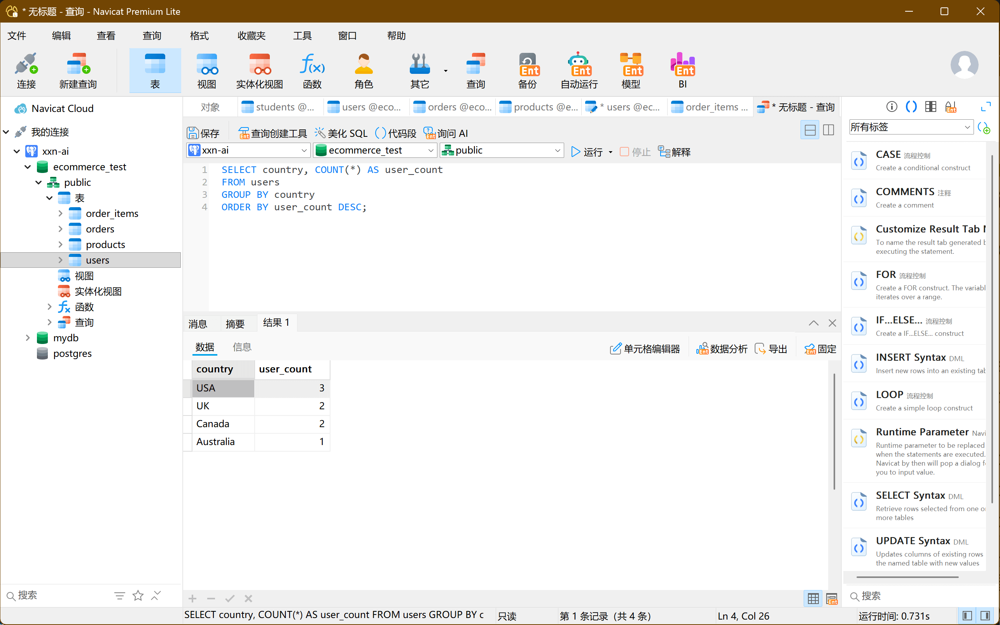

# 技巧巩固

恭喜你快速掌握了 PostgreSQL 的基础操作！接下来可以从以下几个方向深入学习：

## 建议学习路径

1. **SQL 进阶**：复杂查询、子查询、CTE (公用表表达式)、窗口函数、聚合函数高级用法
2. **PostgreSQL 特性**：索引优化、事务与 ACID、存储过程 / 函数、触发器、视图
3. **数据库设计**：范式理论、表关系设计、约束设计
4. **性能调优**：执行计划分析、索引优化、查询优化
5. **数据库管理**：备份恢复、用户权限、角色管理、监控

## 测试数据生成

首先我们创建一个电商相关的测试数据库，包含用户、产品、订单等表结构并插入测试数据：

```sql
-- 创建数据库
CREATE DATABASE ecommerce_test;

-- 切换到新数据库
\c ecommerce_test;

-- 创建用户表
CREATE TABLE users (
    user_id SERIAL PRIMARY KEY,
    username VARCHAR(50) UNIQUE NOT NULL,
    email VARCHAR(100) UNIQUE NOT NULL,
    created_at TIMESTAMP DEFAULT CURRENT_TIMESTAMP,
    country VARCHAR(50),
    age INT CHECK (age > 0)
);
-- SERIAL 代表自增主键


-- 创建产品表
CREATE TABLE products (
    product_id SERIAL PRIMARY KEY,
    product_name VARCHAR(100) NOT NULL,
    category VARCHAR(50) NOT NULL,
    price DECIMAL(10, 2) NOT NULL CHECK (price >= 0),
    stock_quantity INT NOT NULL DEFAULT 0 CHECK (stock_quantity >= 0)
);

-- 创建订单表
CREATE TABLE orders (
    order_id SERIAL PRIMARY KEY,
    user_id INT NOT NULL REFERENCES users(user_id),
    order_date TIMESTAMP DEFAULT CURRENT_TIMESTAMP,
    total_amount DECIMAL(10, 2) NOT NULL CHECK (total_amount >= 0),
    status VARCHAR(20) NOT NULL CHECK (status IN ('pending', 'completed', 'cancelled'))
);

-- 创建订单项表
CREATE TABLE order_items (
    order_item_id SERIAL PRIMARY KEY,
    order_id INT NOT NULL REFERENCES orders(order_id),
    product_id INT NOT NULL REFERENCES products(product_id),
    quantity INT NOT NULL CHECK (quantity > 0),
    unit_price DECIMAL(10, 2) NOT NULL CHECK (unit_price >= 0)
);

-- 插入用户数据
INSERT INTO users (username, email, country, age) VALUES
('alice', 'alice@example.com', 'USA', 30),
('bob', 'bob@example.com', 'Canada', 25),
('charlie', 'charlie@example.com', 'UK', 35),
('diana', 'diana@example.com', 'USA', 28),
('eric', 'eric@example.com', 'Australia', 40),
('fiona', 'fiona@example.com', 'Canada', 22),
('greg', 'greg@example.com', 'UK', 45),
('hannah', 'hannah@example.com', 'USA', 29);

-- 插入产品数据
INSERT INTO products (product_name, category, price, stock_quantity) VALUES
('Laptop Pro', 'Electronics', 1200.00, 50),
('Wireless Mouse', 'Electronics', 25.50, 200),
('Mechanical Keyboard', 'Electronics', 89.99, 100),
('Cotton T-Shirt', 'Clothing', 19.99, 300),
('Denim Jeans', 'Clothing', 49.99, 150),
('Running Shoes', 'Footwear', 89.99, 120),
('Yoga Mat', 'Fitness', 29.99, 75),
('Protein Powder', 'Fitness', 39.99, 60);

-- 插入订单数据
INSERT INTO orders (user_id, order_date, total_amount, status) VALUES
(1, '2023-09-01 10:30:00', 1225.50, 'completed'),
(1, '2023-09-15 14:20:00', 89.99, 'completed'),
(2, '2023-09-02 09:15:00', 49.99, 'completed'),
(3, '2023-09-03 16:45:00', 119.98, 'completed'),
(3, '2023-09-10 11:20:00', 39.99, 'cancelled'),
(4, '2023-09-05 13:10:00', 89.99, 'completed'),
(5, '2023-09-07 15:30:00', 69.98, 'pending'),
(6, '2023-09-08 10:05:00', 19.99, 'completed'),
(7, '2023-09-09 14:50:00', 1289.99, 'completed'),
(8, '2023-09-12 08:40:00', 59.98, 'completed');

-- 插入订单项数据
INSERT INTO order_items (order_id, product_id, quantity, unit_price) VALUES
(1, 1, 1, 1200.00),
(1, 2, 1, 25.50),
(2, 3, 1, 89.99),
(3, 5, 1, 49.99),
(4, 6, 1, 89.99),
(4, 7, 1, 29.99),
(5, 8, 1, 39.99),
(6, 6, 1, 89.99),
(7, 7, 2, 29.99),
(8, 4, 1, 19.99),
(9, 1, 1, 1200.00),
(9, 3, 1, 89.99),
(10, 4, 2, 19.99),
(10, 7, 1, 29.99);


```

## PostgreSQL 练习题（带答案）

### 基础查询练习

1. **问题**：查询所有用户的用户名和所在国家，按国家字母顺序排序  
   **答案**：

```sql
SELECT username, country
FROM users
ORDER BY country;
```

2. **问题**：查询价格在 50 到 100 之间的产品名称和价格  
   **答案**：

```sql
SELECT product_name, price
FROM products
WHERE price BETWEEN 50 AND 100;
```

3. **问题**：统计每个国家的用户数量  
   **答案**：

```sql
SELECT country, COUNT(*) AS user_count
FROM users
GROUP BY country
ORDER BY user_count DESC;
```



### 连接查询练习

4. **问题**：查询所有订单，显示订单 ID、用户名和订单状态  
   **答案**：

```sql
SELECT o.order_id, u.username, o.status
FROM orders o
JOIN users u ON o.user_id = u.user_id;
```

5. **问题**：查询每个订单包含的产品名称和数量  
   **答案**：

```sql
SELECT o.order_id, p.product_name, oi.quantity
FROM order_items oi
JOIN orders o ON oi.order_id = o.order_id
JOIN products p ON oi.product_id = p.product_id
ORDER BY o.order_id;
```

6. **问题**：查询总金额大于 1000 的订单及其用户信息  
   **答案**：

```sql
SELECT o.order_id, u.username, o.total_amount, o.order_date
FROM orders o
JOIN users u ON o.user_id = u.user_id
WHERE o.total_amount > 1000
ORDER BY o.total_amount DESC;
```

### 聚合与子查询练习

7. **问题**：计算每个类别的产品平均价格  
   **答案**：

```sql
SELECT category, AVG(price) AS avg_price
FROM products
GROUP BY category
ORDER BY avg_price DESC;
```

8. **问题**：查询购买过 "Electronics" 类产品的用户邮箱  
   **答案**：

```sql
SELECT DISTINCT u.email
FROM users u
JOIN orders o ON u.user_id = o.user_id
JOIN order_items oi ON o.order_id = oi.order_id
JOIN products p ON oi.product_id = p.product_id
WHERE p.category = 'Electronics';
```

9. **问题**：找出每个用户的总消费金额，并只显示总消费超过 1000 的用户  
   **答案**：

```sql
SELECT u.user_id, u.username, SUM(o.total_amount) AS total_spent
FROM users u
JOIN orders o ON u.user_id = o.user_id
GROUP BY u.user_id, u.username
HAVING SUM(o.total_amount) > 1000
ORDER BY total_spent DESC;
```

### 高级查询练习

10. **问题**：使用 CTE (公用表表达式) 查询每个月的订单总金额  
    **答案**：

```sql
WITH monthly_sales AS (
  SELECT
      DATE_TRUNC('month', order_date) AS order_month,
      SUM(total_amount) AS monthly_total
  FROM orders
  GROUP BY DATE_TRUNC('month', order_date)
)
SELECT
  TO_CHAR(order_month, 'YYYY-MM') AS month,
  monthly_total
FROM monthly_sales
ORDER BY order_month;
```

11. **问题**：查询每个产品的销售数量和总销售额  
    **答案**：

```sql
SELECT
    p.product_id,
    p.product_name,
    SUM(oi.quantity) AS total_quantity_sold,
    SUM(oi.quantity * oi.unit_price) AS total_revenue
FROM products p
LEFT JOIN order_items oi ON p.product_id = oi.product_id
GROUP BY p.product_id, p.product_name
ORDER BY total_revenue DESC NULLS LAST;
```

12. **问题**：查询状态为 "completed" 的订单中，每个国家的总消费金额  
    **答案**：

```sql
SELECT
    u.country,
    SUM(o.total_amount) AS total_spent
FROM users u
JOIN orders o ON u.user_id = o.user_id
WHERE o.status = 'completed'
GROUP BY u.country
ORDER BY total_spent DESC;
```

### 数据库操作练习

13. **问题**：创建一个视图，显示每个用户的订单数量和总消费  
    **答案**：

```sql
CREATE VIEW user_order_summary AS
SELECT
    u.user_id,
    u.username,
    COUNT(o.order_id) AS order_count,
    COALESCE(SUM(o.total_amount), 0) AS total_spent
FROM users u
LEFT JOIN orders o ON u.user_id = o.user_id
GROUP BY u.user_id, u.username;
```

14. **问题**：为 products 表的 category 列创建索引，提高按类别查询的速度  
    **答案**：

```sql
CREATE INDEX idx_products_category ON products(category);
```

15. **问题**：编写一个事务，模拟用户购买产品（创建订单、订单项并减少库存）  
    **答案**：

```sql
BEGIN;

-- 1. 创建订单
INSERT INTO orders (user_id, total_amount, status)
VALUES (1, 119.98, 'pending')
RETURNING order_id INTO @order_id; -- 注意：实际使用时需根据客户端语法获取返回的order_id

-- 2. 创建订单项
INSERT INTO order_items (order_id, product_id, quantity, unit_price)
VALUES
    (@order_id, 6, 1, 89.99),
    (@order_id, 7, 1, 29.99);

-- 3. 减少产品库存
UPDATE products SET stock_quantity = stock_quantity - 1 WHERE product_id = 6;
UPDATE products SET stock_quantity = stock_quantity - 1 WHERE product_id = 7;

-- 4. 确认订单状态
UPDATE orders SET status = 'completed' WHERE order_id = @order_id;

COMMIT;
```

这些练习涵盖了 PostgreSQL 的核心功能和 SQL 高级特性。完成后，你可以尝试更复杂的场景，比如创建触发器自动更新库存、编写存储过程处理订单逻辑，或者学习 PostgreSQL 的全文搜索功能等高级特性。
